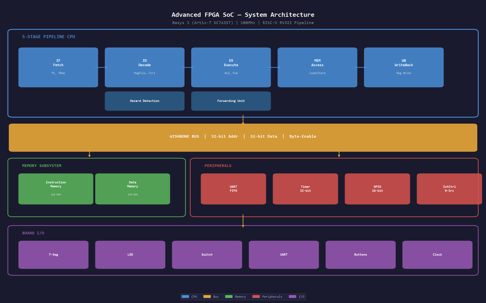
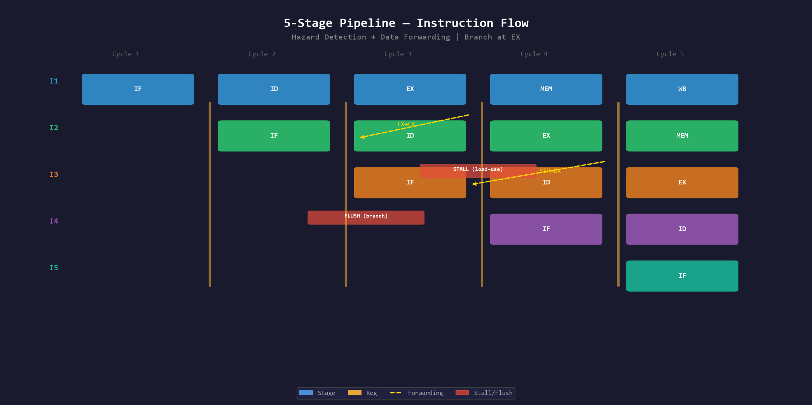
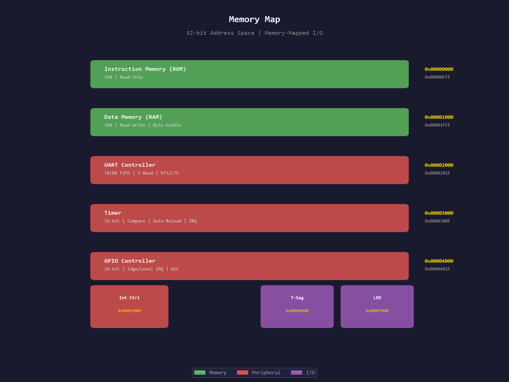

# Advanced FPGA SoC — Pipelined RISC-V Like Processor

A complete System-on-Chip featuring a 5-stage pipelined processor, cache, interrupt controller, enhanced UART, GPIO, and timer — all synthesized onto the Basys 3 FPGA (Xilinx Artix-7 XC7A35T).

## Diagrams

| Diagram | Description |
|---------|-------------|
|  | Full SoC block diagram with all components |
|  | 5-stage instruction flow with forwarding and hazards |
|  | Address space layout and peripheral registers |

## Architecture

```
┌─────────────────────────────────────────────────────────────────────────┐
│                         SOC TOP MODULE                                  │
│                                                                        │
│  ┌──────────────────────────────────────────────────────────────────┐  │
│  │                    5-STAGE PIPELINE CPU                          │  │
│  │                                                                  │  │
│  │  ┌─────┐   ┌─────┐   ┌─────┐   ┌──────┐   ┌─────┐            │  │
│  │  │ IF  │──►│ ID  │──►│ EX  │──►│ MEM  │──►│ WB  │            │  │
│  │  └──┬──┘   └──┬──┘   └──┬──┘   └──┬───┘   └──┬──┘            │  │
│  │     │         │         │         │           │                │  │
│  │  ┌──┴──┐   ┌──┴──┐   ┌──┴──┐   ┌──┴───┐   ┌──┴──┐            │  │
│  │  │PC+4 │   │Ctrl │   │ALU  │   │DMem  │   │WBack│            │  │
│  │  │Branch│  │Decod│   │Fwd  │   │Cache │   │Mux  │            │  │
│  │  │Mux  │   │RegF │   │HazD │   │      │   │     │            │  │
│  │  └─────┘   └─────┘   └─────┘   └──────┘   └─────┘            │  │
│  │       │ HazDet │ Forwarding │                                  │  │
│  └───────┼────────┼────────────┼──────────────────────────────────┘  │
│          │        │            │                                      │
│  ┌───────┴────────┴────────────┴──────────────────────────────────┐  │
│  │                    WISHBONE BUS INTERCONNECT                   │  │
│  │  Addr Decode:                                                  │  │
│  │    0x00000000 - 0x00000FFF  Instruction Memory (1KB)           │  │
│  │    0x00001000 - 0x00001FFF  Data Memory (1KB)                  │  │
│  │    0x00002000 - 0x0000201F  UART (FIFO, Flow Ctrl)            │  │
│  │    0x00003000 - 0x0000300F  Timer (Compare, Auto-reload)       │  │
│  │    0x00004000 - 0x0000401F  GPIO (16-bit, IRQ)                 │  │
│  │    0x00005000 - 0x0000500F  Interrupt Controller (8-src)       │  │
│  │    0x00006000               7-Segment Display                   │  │
│  │    0x00007000               LED Output                          │  │
│  └───────┬────────┬────────┬────────┬────────┬────────┬──────────┘  │
│          │        │        │        │        │        │              │
│  ┌───────▼──┐ ┌───▼──┐ ┌──▼───┐ ┌──▼──┐ ┌──▼──┐ ┌──▼────┐        │
│  │ IMem     │ │ DMem │ │ UART │ │Timer│ │GPIO │ │IntCtrl│        │
│  │ 1KB ROM  │ │ 1KB  │ │FIFO  │ │32b  │ │16b  │ │8-src  │        │
│  │          │ │ RAM  │ │+Flow │ │+IRQ │ │+IRQ │ │+Prio  │        │
│  └──────────┘ └──────┘ └──────┘ └─────┘ └─────┘ └───────┘        │
│                                                                    │
│  ┌──────────────┐  ┌──────────────┐                                │
│  │ 7-Seg Driver │  │   LED Reg    │                                │
│  │ (4-digit)    │  │  (16-bit)    │                                │
│  └──────────────┘  └──────────────┘                                │
└─────────────────────────────────────────────────────────────────────┘
```

## Pipeline Stages

### IF (Instruction Fetch)
- PC management with branch/jump redirect
- Instruction memory access
- PC+4 calculation

### ID (Instruction Decode)
- Full RISC-V instruction decoder (R/I/S/B/U/J types)
- Register file read (32 x 32-bit)
- Immediate generation (I/S/B/U/J formats)
- Control signal generation

### EX (Execute)
- 32-bit ALU (14 operations)
- Data forwarding (EX→EX, MEM→EX)
- Branch condition evaluation
- Branch target calculation

### MEM (Memory Access)
- Data memory read/write
- Byte-enable support
- Branch result resolution

### WB (Write Back)
- Register file write
- MUX between ALU result and memory data

## Hazard Handling

### Data Hazards
- **Load-use stall**: 1-cycle bubble inserted
- **EX→EX forward**: Bypass from EX/MEM pipeline register
- **MEM→EX forward**: Bypass from MEM/WB pipeline register
- **Priority**: EX stage result > MEM stage result > register file

### Control Hazards
- **Branch resolution**: EX stage (2-cycle penalty)
- **Pipeline flush**: IF/ID and ID/EX registers cleared on branch taken
- **Branch prediction**: Always-not-taken (simple)

## Instruction Set (RISC-V RV32I subset)

| Type  | Instructions                                                    |
|-------|-----------------------------------------------------------------|
| R     | ADD, SUB, SLL, SLT, XOR, SRL, SRA, OR, AND, MUL, DIV, MOD     |
| I     | ADDI, SLTI, XORI, ORI, ANDI, SLLI, SRLI, SRAI, LW, JALR       |
| S     | SW, SH, SB                                                       |
| B     | BEQ, BNE, BLT, BGE, BLTU, BGEU                                 |
| U     | LUI, AUIPC                                                       |
| J     | JAL                                                              |

## Cache

- **Type**: Direct-mapped, write-back
- **Size**: 256 lines x 4 words/line = 4KB
- **Block size**: 16 bytes (4 x 32-bit words)
- **Replacement**: N/A (direct-mapped)
- **Write policy**: Write-back with dirty bit
- **Fetch**: On miss, fills entire block from memory

## Peripherals

### UART (Enhanced)
- TX/RX FIFOs (16-deep)
- 5 baud rates: 9600, 19200, 38400, 57600, 115200
- RTS/CTS hardware flow control
- Memory-mapped registers (TX data, RX data, Status, Control, Baud)

### Timer
- 32-bit free-running counter
- Programmable compare value
- Auto-reload mode
- Interrupt on match

### GPIO
- 16-bit port (input + output)
- Programmable output enable per pin
- Edge/level triggered interrupts
- Per-pin polarity control
- Write-1-to-clear interrupt status

### Interrupt Controller
- 8 external interrupt sources
- Priority-encoded (IRQ0 highest)
- Enable/mask per source
- Acknowledge/clear mechanism
- Status register (pending, active, sources)

## Memory Map

| Address Range     | Peripheral          | Description                     |
|-------------------|---------------------|---------------------------------|
| 0x00000000-0x0FFF | Instruction Memory  | 1KB read-only program storage   |
| 0x00001000-0x1FFF | Data Memory         | 1KB read-write data storage     |
| 0x00002000-0x201F | UART                | TX/RX FIFO, baud, flow control  |
| 0x00003000-0x300F | Timer               | Count, compare, control         |
| 0x00004000-0x401F | GPIO                | Port, OE, interrupts            |
| 0x00005000-0x500F | Interrupt Controller| Pending, enable, status         |
| 0x00006000        | 7-Segment Display   | Write value to display          |
| 0x00007000        | LED Output          | Write 16-bit value to LEDs      |

## File Structure

```
fpga-soc-project/
├── src/
│   ├── cpu/
│   │   ├── pipeline_reg_if_id.v    # IF/ID pipeline register
│   │   ├── pipeline_reg_id_ex.v    # ID/EX pipeline register
│   │   ├── pipeline_reg_ex_mem.v   # EX/MEM pipeline register
│   │   ├── pipeline_reg_mem_wb.v   # MEM/WB pipeline register
│   │   ├── hazard_detection.v      # Load-use hazard detector
│   │   ├── forwarding_unit.v       # Data forwarding logic
│   │   ├── alu_32.v                # 32-bit ALU (14 ops)
│   │   ├── register_file_32.v      # 32x32-bit register file
│   │   ├── control_unit_32.v       # RISC-V instruction decoder
│   │   └── cpu_pipeline.v          # Top-level pipelined CPU
│   ├── mem/
│   │   ├── instruction_memory.v    # 1KB instruction ROM
│   │   ├── data_memory.v           # 1KB data RAM (byte-enable)
│   │   └── cache_controller.v      # Direct-mapped write-back cache
│   ├── bus/
│   │   └── wishbone_bus.v          # Bus interconnect + addr decode
│   ├── peripherals/
│   │   ├── uart_fifo.v             # Parameterized FIFO
│   │   ├── uart_advanced.v         # UART with FIFO + flow control
│   │   ├── timer.v                 # 32-bit timer with IRQ
│   │   ├── interrupt_controller.v  # 8-source priority interrupt ctrl
│   │   ├── gpio_controller.v       # 16-bit GPIO with edge IRQ
│   │   └── seven_seg_4digit.v      # 4-digit 7-segment driver
│   └── soc_top.v                   # Top-level SoC integration
├── sim/
│   ├── pipeline_tb.v               # Pipeline forwarding test
│   ├── uart_advanced_tb.v          # UART FIFO + flow control test
│   ├── interrupt_tb.v              # Interrupt controller test
│   ├── timer_tb.v                  # Timer test
│   ├── gpio_tb.v                   # GPIO test
│   └── modelsim.do                 # ModelSim script
├── constraints/
│   └── basys3.xdc                  # Basys 3 pin constraints
└── README.md
```

## Simulation

```bash
cd sim
vsim -do modelsim.do
```

Or run individually:
```bash
vsim -c -do "run -all" pipeline_tb
vsim -c -do "run -all" uart_advanced_tb
vsim -c -do "run -all" interrupt_tb
vsim -c -do "run -all" timer_tb
vsim -c -do "run -all" gpio_tb
```

## Synthesis (Vivado)

1. Create new project → xc7a35tcpg236-1 (Basys 3)
2. Add all `src/**/*.v` files
3. Add `constraints/basys3.xdc`
4. Run Synthesis → Implementation → Bitstream
5. Program the board

## Usage

1. Open serial terminal at **9600 baud** (default)
2. Write program to instruction memory via UART (address 0x00000000)
3. CPU begins execution from address 0x00000000
4. Results appear on 7-segment display and LEDs
5. GPIO reads from switches, drives LEDs
6. Timer generates periodic interrupts
7. UART provides bidirectional communication
